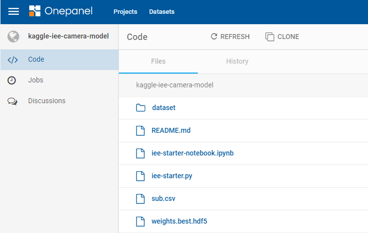
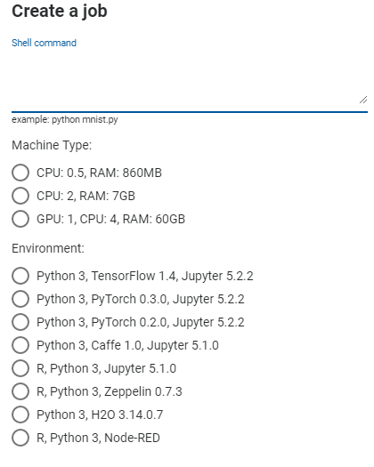
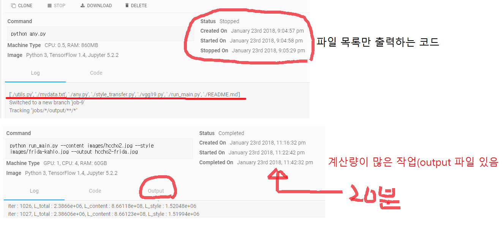

# onepanel 사용법(Windows환경)
### GPU가 없어, 딥러닝을 돌릴 수 없는 분에게만 권장
 * 대기 시간이 많이 걸리기 때문에...

### https://c.onepanel.io/
 * onepanel 사이트에 가서 ID를 만든다.
 
### Projects & Datasets

 * project만들기: 상단의 Projects --> +Create 버튼을 눌러, projects Name입력, private/public 선택
 * dataset만들기: 상단의 Datasets --> +Create 버튼을 눌러, Dataset Name입력, private/public 선택
 * project에는 source code, data 등을 올려 놓고, 실행시킬 수 있다. 
 * datasets에서는 대용량 data를 관리한다. 저 용량의 data는 그냥 project 아래에 올려 놓을 수도 있다.


### project에 소스코드(+data) 올리기
 * onepanel 사이트에서 project를 하나 만든다(예: myproject)
 * onepanel 설치
	``` js
	> pip install onepanel	
	``` 
 * cmd창에서 local pc에 project 만들기를 원하는 곳으로 이동
	``` js
	> onepanel clone 본인ID/projects/프로젝트이름
	> onepanel clone hccho/projects/myproject
	``` 
 * 위와 같이 실행하면, 프로젝트이름과 동일한 디렉토리가 생성된다. 그 디렉토리로 이동한다.
 	``` js
	> cd myproject
	``` 
 * local pc상에서 git에 로그인을 해야 한다. 이 로그인 과정은 처음 딱 1번만 하면 된다.
 	``` js
	> git config --global user.email xxxx@gmail.com
	```  
 * myproject(예) 아래에 필요한 소스 파일과 그 외 필요한 파일을 만들면 된다. 하위 디렉토리를 만들어도 된다.
 * 이제 만들어진 파일들(하위 디렉토리 포함)를 onepanel project에 올려보자. 3개의 명령을 실행하면 파일이 올려진다.
  	``` js
	> git add .
	> git commit -m "add README"
	> onepanel push
	```  
 * 위의 명령 3개는 반복 사용할 수도 있으니, 배치 파일로 만들어 사용하면 편리하다.
 * 새로운 파일이 생기거나, 기존 파일의 내용이 바뀌면 위의 3개 명령을 순서대로 실행하면 된다.
 * 파일들이 잘 올려졌는지, onepanel 사이트에서 확인하면 된다.
	


### 출력파일 path 설정
 * argument를 넘겨줄 때: 소스 코드 내에서 출력파일을 만들 경우에, path를 잘 설정해야 한다. 그냥 파일 이름만 명시하면, working 디렉토리에 생기지는 않는다.
 * '~/output/파일이름"
 *  소스코드 내에서 path를 설정할 때는 ~를 사용하지 않고, 보통의 방법으로 하면 됨
 
### Python 파일 실행하기
 * 실행은 onepanel 사이트의 왼쪽 Jobs 탭을 누르면 된다. 그 다음, +Create을 누르면 된다.
	 
 * 실행 명령 입력, Machine Type 선택, Environment 선택
 * 실행명령 예1:
  	``` js
	python xxx.py
	```   
 * 실행명령 예2: 복수의 명령은 &&로 연결
  	``` js
	python xxx.py && python xxx2.py
	```   

### Test 결과
 * CPY: 0.5 Type은 비교적(?) 빨리 실행됨
 * GPU: 1 이나, GPU: 2는 짧게는 5분, 길게는 10시간 이상 대기 후 실행 됨.
	


### Notebook 환경
 * Nonotebook을 생성한 후, SSH에 들어가서, > onepanel pull
 * 이렇게 해야, 파일을 가져온다.
